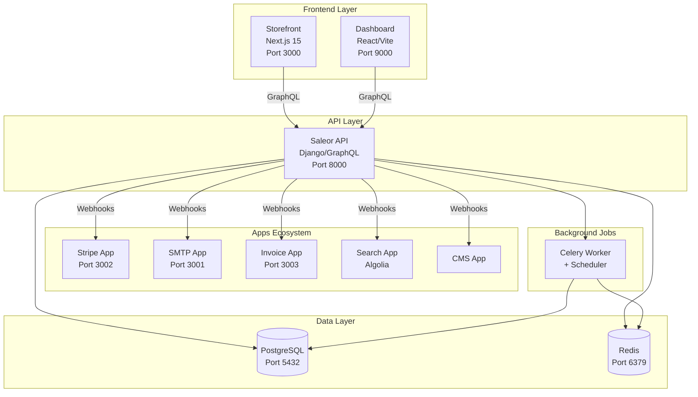

# Saleor Platform - Comprehensive Analysis & Feature Roadmap

**Generated:** December 2024  
**Platform Version:** Saleor 3.23.0-a.0  
**Storefront:** Next.js 15, React 19  
**Status:** Production-Ready with Enhancement Opportunities

---

## Executive Summary

The Saleor Platform is a complete, enterprise-grade e-commerce solution built on a modern, headless architecture. The platform consists of three core components: a Django/GraphQL backend API, a React-based admin dashboard, and a Next.js 15 customer-facing storefront. The current implementation provides a solid foundation with core e-commerce functionality, payment processing, email notifications, and invoice generation. This document provides a comprehensive analysis of the platform's current state and proposes 10 critical features to enhance the storefront's competitiveness in the modern e-commerce landscape.

### Key Highlights

- ✅ **Complete Backend**: Full-featured Saleor API with GraphQL, multi-channel support, inventory management
- ✅ **Admin Dashboard**: Comprehensive management interface for products, orders, customers
- ✅ **Functional Storefront**: Modern Next.js 15 storefront with product catalog, cart, checkout
- ✅ **Payment Integration**: Stripe and Adyen payment gateways fully integrated
- ✅ **Email System**: 14 professional email templates with MJML responsive design
- ✅ **Infrastructure**: Docker-based development and production environments

### Current Gaps

- ⚠️ **Product Reviews**: UI exists but no backend integration
- ⚠️ **Advanced Search**: Basic search exists, lacks faceted search and autocomplete
- ⚠️ **Analytics**: No built-in analytics or conversion tracking
- ⚠️ **Personalization**: Limited customer personalization features
- ⚠️ **Marketing Tools**: Missing abandoned cart recovery, email campaigns

---

## Platform Architecture

### System Overview

The Saleor Platform follows a headless, API-first architecture that separates concerns and enables independent scaling of components.



### Technology Stack

#### Backend (Saleor API)

- **Framework**: Django 5.2.8
- **API**: GraphQL (Graphene)
- **Database**: PostgreSQL 15
- **Cache**: Redis 7
- **Task Queue**: Celery with Redis broker
- **Language**: Python 3.12
- **Authentication**: JWT tokens

#### Storefront

- **Framework**: Next.js 15.1.4
- **React**: 19.1.0
- **Styling**: Tailwind CSS 3.4.0
- **State Management**: Zustand 4.4.6
- **GraphQL Client**: URQL 4.0.6
- **TypeScript**: 5.3.3 (strict mode)
- **Code Generation**: GraphQL Codegen

#### Dashboard

- **Framework**: React with Vite
- **GraphQL**: Apollo Client
- **UI Library**: Custom Macaw components
- **TypeScript**: Full type safety

#### Infrastructure

- **Containerization**: Docker & Docker Compose
- **Package Manager**: pnpm 10.23.0
- **Monorepo**: Turbo (for apps)
- **Node Version**: 22.x

---

## Component Analysis

### 1. Saleor API (Backend)

**Location**: `saleor/`  
**Status**: ✅ Production Ready

#### Core Features

**Product Management**

- Product catalog with variants, attributes, and metadata
- Category hierarchy with MPTT (Modified Preorder Traversal Tree)
- Collections for product grouping
- Digital and physical products
- Inventory tracking with warehouses
- Stock management with low stock alerts

**Order Management**

- Complete order lifecycle (draft → confirmed → fulfilled → delivered)
- Order status tracking
- Payment status management
- Fulfillment tracking with tracking numbers
- Returns and refunds support
- Multi-warehouse fulfillment

**Customer Management**

- User authentication (email/password, OAuth)
- Customer profiles with metadata
- Address book management
- Order history
- Customer segmentation support

**Multi-Channel Architecture**

- Per-channel pricing and currency
- Channel-specific product visibility
- Channel-based inventory
- Multi-warehouse support

**Promotions & Discounts**

- Vouchers and gift cards
- Cart rules and promotions
- Sale pricing
- Automatic discount application

**Payment Processing**

- Flexible payment gateway architecture
- Webhook-based payment apps
- Support for multiple payment methods
- 3D Secure authentication

**GraphQL API**

- Full schema introspection
- Real-time subscriptions support
- Optimized queries with DataLoader
- Permission-based access control

#### Key Files

- `saleor/saleor/graphql/` - GraphQL schema definitions
- `saleor/saleor/core/` - Core business logic
- `saleor/saleor/plugins/` - Plugin system

### 2. Saleor Dashboard (Admin)

**Location**: `dashboard/`  
**Status**: ✅ Production Ready

#### Features

**Product Management UI**

- Product creation and editing
- Variant management
- Image upload and management
- Category and collection management
- Bulk operations

**Order Management**

- Order list with filtering and search
- Order detail view with full history
- Invoice generation and management
- Fulfillment creation
- Payment capture and refunds

**Customer Management**

- Customer list and search
- Customer detail pages
- Order history per customer
- Customer notes and metadata

**App Management**

- App installation and configuration
- Webhook management
- App settings UI

**Settings & Configuration**

- Store settings
- Shipping zones and methods
- Tax configuration
- Payment gateway setup
- Staff user management

#### Recent Enhancements

- Auto-refresh invoice list after generation
- Delete invoice functionality
- Improved invoice preview

### 3. Storefront (Customer-Facing)

**Location**: `storefront/`  
**Status**: ✅ Functional, ⚠️ Needs Enhancement

#### Current Features

**Product Catalog**

- Product listing with pagination
- Product detail pages with variants
- Category and collection pages
- Image galleries with zoom
- Product filtering (price, category, availability, sale status)
- Sort options (price, name, newest)
- Search functionality

**Shopping Experience**

- Shopping cart with quantity management
- Guest checkout support
- Single-page checkout flow
- Address management
- Shipping method selection
- Payment method selection (Stripe, Adyen)

**User Account**

- User registration and login
- OAuth authentication support
- Order history with tracking
- Address book management
- Account settings
- Wishlist (stored in user metadata)

**UI Components**

- Modern, responsive design with Tailwind CSS
- Product cards with hover effects
- Loading skeletons
- Toast notifications
- Mobile-optimized navigation
- Breadcrumb navigation

#### Current Implementation Details

**Product Filters** (`storefront/src/ui/components/Filters/ProductFilters.tsx`)

- Category filtering with hierarchical support
- Price range slider
- In-stock filter
- On-sale filter
- Brand, size, color filters (UI ready, needs data)
- URL-based filter state (shareable URLs)
- Filter persistence in localStorage

**Search** (`storefront/src/app/[channel]/(main)/search/`)

- Basic product search
- Search results page
- Client-side filtering on search results
- No autocomplete or suggestions yet

**Wishlist** (`storefront/src/lib/wishlist.tsx`)

- Client-side wishlist with React Context
- Backend storage in user metadata
- Syncs across devices for logged-in users
- localStorage fallback for guests
- Migration from localStorage to backend

**Checkout Flow** (`storefront/src/checkout/`)

- Single-page checkout
- Address form with validation
- Shipping method selection
- Payment gateway integration
- Order confirmation page
- Portable checkout components (framework-agnostic)

#### Feature Toggles

The storefront uses a configuration system (`storefront/src/config/store.config.ts`) with feature toggles:

```typescript
features: {
  wishlist: boolean;
  compareProducts: boolean;
  productReviews: boolean;
  recentlyViewed: boolean;
  guestCheckout: boolean;
  expressCheckout: boolean;
  savePaymentMethods: boolean;
  digitalDownloads: boolean;
  subscriptions: boolean;
  giftCards: boolean;
  productBundles: boolean;
  newsletter: boolean;
  promotionalBanners: boolean;
  abandonedCartEmails: boolean;
  socialLogin: boolean;
  shareButtons: boolean;
  instagramFeed: boolean;
}
```

**Current State**: Most features are toggled `true` in config but not fully implemented.

### 4. Apps Ecosystem

#### Stripe App (`apps/apps/stripe/`)

- **Status**: ✅ Complete
- Payment processing with Stripe
- 3D Secure support
- Webhook handling
- Refund processing
- PostgreSQL storage for configuration

#### SMTP App (`apps/apps/smtp/`)

- **Status**: ✅ Complete
- 14 professional email templates:
  - Order Created/Confirmed/Fulfilled/Paid/Cancelled/Refunded
  - Invoice Sent (with PDF attachment)
  - Gift Card Sent
  - Account Confirmation/Password Reset/Email Change/Delete
- MJML responsive templates
- Handlebars templating
- Easy branding customization

#### Invoice App (`apps/apps/invoices/`)

- **Status**: ✅ Complete
- PDF invoice generation
- Professional design with branding
- Email delivery with attachment
- Dashboard integration

#### Search App (`apps/apps/search/`)

- **Status**: ⚠️ Optional
- Algolia integration
- Product indexing
- Faceted search support

#### CMS App (`apps/apps/cms/`)

- **Status**: ✅ Available
- Content management
- Page builder support

#### Other Apps

- **Klaviyo**: Email marketing integration
- **Segment**: Analytics integration
- **AvaTax**: Tax calculation
- **Products Feed**: Google Shopping feed generation

### 5. Infrastructure

**Location**: `infra/`

#### Docker Setup

- Development environment: `docker-compose.dev.yml`
- Production environment: `docker-compose.prod.yml`
- Hot-reload for all services
- Volume mounting for local development

#### Services

- PostgreSQL 15 (data persistence)
- Redis 7 (caching and Celery broker)
- Saleor API (Django/GraphQL)
- Dashboard (React admin)
- Storefront (Next.js)
- Stripe App
- SMTP App
- Invoice App
- Celery Worker (background jobs)
- Celery Beat (scheduled tasks)

#### Automation

- 78+ PowerShell scripts for setup and management
- Environment configuration scripts
- Tunnel setup for webhook testing
- Database migration scripts

---

## Current Feature Matrix

| Feature Category    | Feature                 | Backend | Dashboard | Storefront      | Status            |
| ------------------- | ----------------------- | ------- | --------- | --------------- | ----------------- |
| **Products**        | Product Catalog         | ✅      | ✅        | ✅              | Complete          |
|                     | Product Variants        | ✅      | ✅        | ✅              | Complete          |
|                     | Product Attributes      | ✅      | ✅        | ✅              | Complete          |
|                     | Product Images          | ✅      | ✅        | ✅              | Complete          |
|                     | Product Search          | ✅      | ✅        | ⚠️ Basic        | Needs Enhancement |
|                     | Product Filters         | ✅      | N/A       | ✅              | Complete          |
|                     | Product Reviews         | ⚠️      | ⚠️        | ⚠️ UI Only      | Not Implemented   |
|                     | Product Recommendations | ❌      | ❌        | ❌              | Missing           |
| **Cart & Checkout** | Shopping Cart           | ✅      | N/A       | ✅              | Complete          |
|                     | Guest Checkout          | ✅      | N/A       | ✅              | Complete          |
|                     | Checkout Flow           | ✅      | N/A       | ✅              | Complete          |
|                     | Address Management      | ✅      | ✅        | ✅              | Complete          |
|                     | Shipping Methods        | ✅      | ✅        | ✅              | Complete          |
|                     | Payment Processing      | ✅      | ✅        | ✅              | Complete          |
|                     | Order Confirmation      | ✅      | ✅        | ✅              | Complete          |
| **User Account**    | Registration            | ✅      | N/A       | ✅              | Complete          |
|                     | Login/Logout            | ✅      | N/A       | ✅              | Complete          |
|                     | OAuth Login             | ✅      | N/A       | ✅              | Complete          |
|                     | Order History           | ✅      | ✅        | ✅              | Complete          |
|                     | Order Tracking          | ✅      | ✅        | ✅              | Complete          |
|                     | Address Book            | ✅      | ✅        | ✅              | Complete          |
|                     | Wishlist                | ✅      | N/A       | ✅              | Complete          |
|                     | Saved Payment Methods   | ⚠️      | ⚠️        | ❌              | Partial           |
|                     | Account Settings        | ✅      | N/A       | ✅              | Complete          |
| **Payments**        | Stripe Integration      | ✅      | ✅        | ✅              | Complete          |
|                     | Adyen Integration       | ✅      | ✅        | ✅              | Complete          |
|                     | Multiple Gateways       | ✅      | ✅        | ✅              | Complete          |
|                     | 3D Secure               | ✅      | ✅        | ✅              | Complete          |
| **Marketing**       | Promotions              | ✅      | ✅        | ⚠️ Display Only | Partial           |
|                     | Vouchers                | ✅      | ✅        | ✅              | Complete          |
|                     | Gift Cards              | ✅      | ✅        | ⚠️ Display Only | Partial           |
|                     | Newsletter Signup       | ❌      | ❌        | ⚠️ UI Only      | Not Implemented   |
|                     | Abandoned Cart          | ❌      | ❌        | ❌              | Missing           |
|                     | Email Campaigns         | ⚠️      | ⚠️        | N/A             | Via Klaviyo       |
| **Content**         | CMS Pages               | ✅      | ✅        | ✅              | Complete          |
|                     | Blog/News               | ⚠️      | ⚠️        | ⚠️              | Partial           |
|                     | SEO Management          | ✅      | ✅        | ✅              | Complete          |
| **Analytics**       | Sales Reports           | ⚠️      | ⚠️        | N/A             | Basic             |
|                     | Customer Analytics      | ❌      | ❌        | N/A             | Missing           |
|                     | Conversion Tracking     | ❌      | ❌        | ❌              | Missing           |
|                     | Google Analytics        | ❌      | ❌        | ❌              | Missing           |
| **Other**           | Multi-Channel           | ✅      | ✅        | ✅              | Complete          |
|                     | Multi-Currency          | ✅      | ✅        | ✅              | Complete          |
|                     | Multi-Language          | ✅      | ✅        | ⚠️              | Partial           |
|                     | Inventory Management    | ✅      | ✅        | ⚠️ Display Only | Complete          |
|                     | Invoice Generation      | ✅      | ✅        | ✅              | Complete          |
|                     | Email Notifications     | ✅      | ✅        | ✅              | Complete          |

**Legend:**

- ✅ Complete and functional
- ⚠️ Partial implementation or needs enhancement
- ❌ Not implemented

---

## Storefront Feature Analysis

### Strengths

1. **Modern Tech Stack**: Next.js 15 with React 19 provides excellent performance and developer experience
2. **Type Safety**: Full TypeScript with GraphQL code generation ensures type safety
3. **Responsive Design**: Mobile-first design with Tailwind CSS
4. **SEO Optimized**: Server-side rendering, meta tags, structured data ready
5. **Performance**: Image optimization, lazy loading, code splitting
6. **User Experience**: Smooth animations, loading states, error handling

### Current Capabilities

#### Product Discovery

- ✅ Product listing with pagination
- ✅ Category and collection browsing
- ✅ Basic search functionality
- ✅ Advanced filtering (price, category, availability, sale)
- ✅ Sort options
- ⚠️ No autocomplete search
- ⚠️ No faceted search
- ⚠️ No search suggestions

#### Shopping Experience

- ✅ Add to cart functionality
- ✅ Cart management (quantity, remove items)
- ✅ Guest checkout
- ✅ Single-page checkout
- ✅ Multiple payment methods
- ✅ Address validation
- ⚠️ No saved payment methods
- ⚠️ No express checkout (Apple Pay, Google Pay)

#### User Engagement

- ✅ Wishlist functionality
- ✅ Order tracking
- ✅ Account management
- ⚠️ Product reviews (UI only, no backend)
- ❌ No product recommendations
- ❌ No recently viewed products
- ❌ No product comparison

#### Marketing Features

- ⚠️ Newsletter signup (UI only)
- ❌ No abandoned cart recovery
- ❌ No promotional banners
- ❌ No social sharing
- ❌ No referral program

### Gaps Identified

1. **Product Reviews & Ratings**: UI components exist but no backend integration
2. **Advanced Search**: Basic search lacks autocomplete, suggestions, and faceted search
3. **Analytics**: No built-in analytics or conversion tracking
4. **Personalization**: Limited customer personalization (no recommendations, recently viewed)
5. **Marketing Automation**: Missing abandoned cart emails, promotional campaigns
6. **Social Features**: No social login, sharing, or social proof
7. **Performance Monitoring**: No real-time performance metrics
8. **A/B Testing**: No experimentation framework
9. **Customer Service**: No live chat or support ticket system
10. **Mobile App**: No PWA or native mobile app

---

## 10 Critical Feature Proposals

Based on the analysis, here are 10 important features that would significantly enhance the storefront's competitiveness and user experience.

### 1. Product Reviews & Ratings System

**Priority**: 🔴 High  
**Business Impact**: ⭐⭐⭐⭐⭐  
**Technical Complexity**: Medium

#### Description

Implement a complete product review and rating system that allows customers to leave reviews, upload photos, and rate products. Display aggregate ratings on product cards and detail pages.

#### Business Value

- **Trust Building**: Social proof increases conversion rates by 15-30%
- **SEO Benefits**: User-generated content improves search rankings
- **Customer Insights**: Reviews provide valuable product feedback
- **Reduced Returns**: Better product information reduces mismatched expectations

#### Technical Approach

**Backend (Saleor API)**

- Extend GraphQL schema with review mutations and queries
- Create `ProductReview` model with fields:
  - Product reference
  - User reference (optional for guest reviews)
  - Rating (1-5 stars)
  - Title and body text
  - Review images
  - Helpful votes
  - Review status (pending, approved, rejected)
- Add review moderation workflow
- Implement review aggregation (average rating, review count)

**Storefront Implementation**

- Create review submission form
- Display reviews on product detail pages
- Show aggregate ratings on product cards
- Implement review filtering (by rating, verified purchase, helpful)
- Add review image upload
- Implement "Helpful" voting
- Add review pagination

**GraphQL Schema Example**

```graphql
type ProductReview {
  id: ID!
  product: Product!
  user: User
  rating: Int!
  title: String!
  body: String!
  images: [String!]!
  helpfulCount: Int!
  createdAt: DateTime!
  isVerifiedPurchase: Boolean!
}

type Mutation {
  createProductReview(input: CreateReviewInput!): ProductReview!
  markReviewHelpful(reviewId: ID!): Boolean!
}

type Query {
  productReviews(productId: ID!, first: Int, after: String): ReviewConnection!
}
```

**Integration Points**

- Use existing product detail page (`storefront/src/app/[channel]/(main)/products/[slug]/ProductDetailClient.tsx`)
- Extend product card component (`storefront/src/ui/components/ProductCard/ProductCard.tsx`)
- Leverage Saleor's metadata system for review storage
- Use existing image upload infrastructure

**Implementation Complexity**: Medium (2-3 weeks)

- Backend: 1 week (model, GraphQL, moderation)
- Frontend: 1 week (UI components, forms, display)
- Testing & Polish: 1 week

---

### 2. Advanced Search with Autocomplete & Faceted Search

**Priority**: 🔴 High  
**Business Impact**: ⭐⭐⭐⭐⭐  
**Technical Complexity**: Medium-High

#### Description

Enhance the search experience with real-time autocomplete, search suggestions, typo tolerance, and faceted search results with filters.

#### Business Value

- **Improved Discovery**: Better search = more products found = higher conversion
- **User Experience**: Autocomplete reduces friction and search time
- **Revenue Impact**: Sites with advanced search see 2-3x higher search conversion
- **Reduced Bounce**: Better results keep users engaged

#### Technical Approach

**Option A: Algolia Integration (Recommended)**

- Leverage existing Search App (`apps/apps/search/`)
- Configure Algolia indexing for products
- Implement autocomplete dropdown
- Add faceted search with filters
- Implement typo tolerance and synonyms

**Option B: Custom Implementation**

- Build search index using PostgreSQL full-text search
- Implement autocomplete with debounced queries
- Add search suggestions based on popular searches
- Create faceted search with dynamic filters

**Storefront Implementation**

- Enhance search dialog (`storefront/src/ui/components/search/SearchDialog.tsx`)
- Add autocomplete dropdown with product suggestions
- Implement search results page with faceted filters
- Add search history and popular searches
- Show "no results" suggestions

**Features**

- Real-time autocomplete (debounced, 300ms)
- Search suggestions (popular searches, categories)
- Typo tolerance (fuzzy matching)
- Faceted search (category, price, brand, rating)
- Search analytics (track popular searches)
- Recent searches (localStorage)

**Integration Points**

- Extend existing search page (`storefront/src/app/[channel]/(main)/search/page.tsx`)
- Use Search App webhooks for product indexing
- Leverage existing filter components
- Integrate with product listing components

**Implementation Complexity**: Medium-High (3-4 weeks)

- Algolia Setup: 1 week (indexing, configuration)
- Autocomplete: 1 week (UI, debouncing, suggestions)
- Faceted Search: 1 week (filters, result display)
- Testing & Optimization: 1 week

---

### 3. Abandoned Cart Recovery System

**Priority**: 🔴 High  
**Business Impact**: ⭐⭐⭐⭐⭐  
**Technical Complexity**: Medium

#### Description

Automatically detect abandoned carts and send email reminders to customers with personalized product recommendations and discount offers.

#### Business Value

- **Revenue Recovery**: 20-30% of abandoned carts can be recovered
- **Average Recovery Value**: $50-100 per recovered cart
- **ROI**: Email campaigns have 300-400% ROI
- **Customer Retention**: Re-engages customers who were interested

#### Technical Approach

**Backend Implementation**

- Create Celery task to detect abandoned carts (carts older than 1 hour, no checkout)
- Store cart abandonment events in database
- Create email template for cart recovery
- Implement discount code generation for recovery emails
- Track recovery success metrics

**Email Campaign Flow**

1. **First Email** (1 hour after abandonment): Gentle reminder
2. **Second Email** (24 hours): Include discount (10% off)
3. **Third Email** (72 hours): Urgency message, larger discount (15% off)

**Storefront Integration**

- Add "Save for Later" functionality
- Implement cart persistence across sessions
- Add "Return to Cart" CTA in emails
- Track email click-through rates

**SMTP App Enhancement**

- Create abandoned cart email template
- Add personalization variables (cart items, discount code)
- Implement A/B testing for email content

**GraphQL Extensions**

```graphql
type Mutation {
  saveCartForLater(checkoutId: ID!): Boolean!
  restoreAbandonedCart(token: String!): Checkout!
}

type Query {
  abandonedCart(token: String!): Checkout
}
```

**Implementation Complexity**: Medium (2-3 weeks)

- Backend: 1 week (detection, email triggers, discount codes)
- Email Templates: 3 days (design, personalization)
- Frontend: 3 days (cart restoration, tracking)
- Testing: 3 days

---

### 4. Product Recommendations Engine

**Priority**: 🟡 Medium  
**Business Impact**: ⭐⭐⭐⭐  
**Technical Complexity**: Medium-High

#### Description

Implement intelligent product recommendations based on browsing history, purchase history, and collaborative filtering.

#### Business Value

- **Upselling**: Recommendations increase average order value by 10-30%
- **Cross-selling**: Related products drive additional sales
- **Engagement**: Personalized content increases time on site
- **Conversion**: Recommendation widgets convert 3-5% of visitors

#### Technical Approach

**Recommendation Types**

1. **Viewed Together**: Products frequently viewed together
2. **Bought Together**: Collaborative filtering based on purchase history
3. **Similar Products**: Based on attributes, category, price range
4. **Recently Viewed**: Show recently viewed products
5. **Trending**: Popular products in category
6. **Personalized**: Based on user's browsing and purchase history

**Implementation Strategy**

**Phase 1: Simple Recommendations**

- Recently viewed products (localStorage + backend)
- Related products (same category, similar attributes)
- Trending products (best sellers, new arrivals)

**Phase 2: Advanced Recommendations**

- Collaborative filtering (users who bought X also bought Y)
- Machine learning-based recommendations
- Real-time personalization

**Storefront Components**

- "You May Also Like" section on product pages
- "Recently Viewed" section on homepage
- "Recommended For You" on account page
- "Complete the Look" on product pages
- Recommendation widgets in cart

**Backend Implementation**

- Create recommendation service
- Track product views and purchases
- Calculate similarity scores
- Cache recommendations for performance

**GraphQL Schema**

```graphql
type Query {
  productRecommendations(
    productId: ID
    userId: ID
    type: RecommendationType!
    first: Int!
  ): [Product!]!

  recentlyViewedProducts(first: Int!): [Product!]!
}

enum RecommendationType {
  VIEWED_TOGETHER
  BOUGHT_TOGETHER
  SIMILAR
  TRENDING
  PERSONALIZED
}
```

**Implementation Complexity**: Medium-High (3-4 weeks)

- Backend Service: 1.5 weeks (tracking, algorithms, caching)
- Frontend Components: 1 week (widgets, display)
- Personalization: 1 week (user tracking, ML integration)
- Testing: 3 days

---

### 5. Real-Time Inventory & Stock Alerts

**Priority**: 🟡 Medium  
**Business Impact**: ⭐⭐⭐⭐  
**Technical Complexity**: Low-Medium

#### Description

Show real-time inventory levels, low stock warnings, and allow customers to sign up for back-in-stock notifications.

#### Business Value

- **Urgency**: Low stock creates urgency and increases conversions
- **Customer Satisfaction**: Stock alerts reduce customer frustration
- **Inventory Management**: Better visibility into stock levels
- **Reduced Abandonment**: Customers wait for restock instead of leaving

#### Technical Approach

**Backend**

- Expose inventory levels via GraphQL (already available in Saleor)
- Create stock alert subscription system
- Send email notifications when products are back in stock
- Track stock alert subscriptions

**Storefront Features**

- Display stock levels on product pages ("Only 3 left!")
- Show low stock warnings
- "Notify Me" button for out-of-stock items
- Stock alert signup form
- Email notification when back in stock

**UI Components**

- Stock level indicator (badge, progress bar)
- Low stock warning banner
- Back-in-stock notification form
- Stock alert confirmation

**GraphQL Extensions**

```graphql
type Mutation {
  subscribeToStockAlert(productVariantId: ID!, email: String!): StockAlert!
  unsubscribeFromStockAlert(token: String!): Boolean!
}

type StockAlert {
  id: ID!
  productVariant: ProductVariant!
  email: String!
  notified: Boolean!
  createdAt: DateTime!
}
```

**Integration Points**

- Use existing inventory data from Saleor API
- Extend product detail page
- Add to product card component
- Integrate with SMTP app for notifications

**Implementation Complexity**: Low-Medium (1-2 weeks)

- Backend: 3 days (subscriptions, notifications)
- Frontend: 3 days (UI components, forms)
- Email Integration: 2 days (templates, triggers)
- Testing: 2 days

---

### 6. Customer Loyalty & Rewards Program

**Priority**: 🟡 Medium  
**Business Impact**: ⭐⭐⭐⭐⭐  
**Technical Complexity**: Medium

#### Description

Implement a points-based loyalty program where customers earn points for purchases, reviews, referrals, and can redeem points for discounts or products.

#### Business Value

- **Customer Retention**: Loyalty programs increase retention by 20-30%
- **Repeat Purchases**: Members shop 2-3x more frequently
- **Higher AOV**: Loyalty members have 20-30% higher average order value
- **Referral Growth**: Referral rewards drive new customer acquisition

#### Technical Approach

**Loyalty Program Features**

- Points earning (purchases, reviews, referrals, social shares)
- Points redemption (discounts, free products, exclusive access)
- Tier system (Bronze, Silver, Gold, Platinum)
- Referral program with unique codes
- Points expiration (optional)
- Points history and balance display

**Backend Implementation**

- Create loyalty program model
- Track points transactions
- Calculate tier levels
- Generate referral codes
- Handle points redemption
- Create admin dashboard for program management

**Storefront Features**

- Points balance display in account
- Points history page
- Referral code sharing
- Points redemption at checkout
- Tier benefits display
- Progress to next tier

**GraphQL Schema**

```graphql
type LoyaltyAccount {
  id: ID!
  user: User!
  points: Int!
  tier: LoyaltyTier!
  referralCode: String!
  pointsHistory(first: Int!): [PointsTransaction!]!
  nextTierProgress: TierProgress!
}

type Mutation {
  redeemPoints(amount: Int!): DiscountCode!
  generateReferralCode: String!
  applyReferralCode(code: String!): Boolean!
}

enum LoyaltyTier {
  BRONZE
  SILVER
  GOLD
  PLATINUM
}
```

**Integration Points**

- Extend user model with loyalty data
- Integrate with order creation (award points)
- Add to checkout (points redemption)
- Create account dashboard section
- Email notifications for points earned/redeemed

**Implementation Complexity**: Medium (3-4 weeks)

- Backend: 1.5 weeks (models, logic, GraphQL)
- Frontend: 1 week (account pages, checkout integration)
- Admin Dashboard: 3 days (management UI)
- Testing: 3 days

---

### 7. Social Login & Sharing

**Priority**: 🟡 Medium  
**Business Impact**: ⭐⭐⭐  
**Technical Complexity**: Low-Medium

#### Description

Allow customers to login with social accounts (Google, Facebook, Apple) and share products on social media platforms.

#### Business Value

- **Faster Checkout**: Social login reduces friction (no password needed)
- **Higher Conversion**: Social login increases signup rates by 20-30%
- **Social Proof**: Social sharing drives organic traffic
- **Viral Growth**: Easy sharing increases brand awareness

#### Technical Approach

**Social Login**

- Integrate with Saleor's OAuth support (already available)
- Add Google OAuth provider
- Add Facebook OAuth provider
- Add Apple Sign In
- Handle account linking (link social account to existing email)

**Social Sharing**

- Add share buttons to product pages
- Support Facebook, Twitter, Pinterest, WhatsApp, Email
- Generate shareable links with UTM parameters
- Track sharing analytics
- Implement "Share to Earn" rewards (optional)

**Storefront Implementation**

- Add social login buttons to login page
- Social share buttons on product cards and detail pages
- Share preview with product image and description
- Share success confirmation

**OAuth Configuration**
Saleor already supports OAuth providers. Configuration needed:

- Register OAuth apps with providers
- Configure redirect URLs
- Add provider credentials to Saleor settings

**UI Components**

- Social login buttons (Google, Facebook, Apple)
- Share button component
- Share modal with platform options
- Share success toast

**Implementation Complexity**: Low-Medium (1-2 weeks)

- OAuth Setup: 3 days (provider registration, configuration)
- Social Login UI: 2 days (buttons, flow)
- Social Sharing: 2 days (buttons, modals, tracking)
- Testing: 2 days

---

### 8. Advanced Analytics & Conversion Tracking

**Priority**: 🔴 High  
**Business Impact**: ⭐⭐⭐⭐  
**Technical Complexity**: Medium

#### Description

Implement comprehensive analytics tracking including Google Analytics 4, conversion tracking, e-commerce events, and custom dashboards.

#### Business Value

- **Data-Driven Decisions**: Analytics inform product and marketing decisions
- **Conversion Optimization**: Track funnel drop-offs and optimize
- **ROI Measurement**: Measure marketing campaign effectiveness
- **Customer Insights**: Understand customer behavior and preferences

#### Technical Approach

**Analytics Implementation**

**Google Analytics 4**

- Install GA4 tracking code
- Implement e-commerce events:
  - `view_item` (product views)
  - `add_to_cart` (cart additions)
  - `begin_checkout` (checkout start)
  - `purchase` (order completion)
  - `add_payment_info` (payment method added)
- Track custom events (wishlist, reviews, searches)
- Implement enhanced e-commerce tracking

**Conversion Tracking**

- Track conversion funnel (browse → cart → checkout → purchase)
- Measure conversion rates by traffic source
- Track micro-conversions (email signups, reviews)
- A/B test tracking

**Custom Analytics Dashboard**

- Sales overview (revenue, orders, AOV)
- Product performance (best sellers, views, conversion)
- Customer analytics (new vs returning, lifetime value)
- Traffic sources and campaigns
- Conversion funnel visualization

**Storefront Implementation**

- Add analytics tracking script
- Implement event tracking throughout user journey
- Add conversion pixels (Facebook, Google Ads)
- Create analytics dashboard (admin)

**Backend Support**

- Expose analytics data via GraphQL
- Aggregate metrics for dashboard
- Store event data (optional, for custom analytics)

**Privacy Compliance**

- Cookie consent banner (GDPR, CCPA)
- Opt-out functionality
- Anonymize IP addresses
- Respect Do Not Track headers

**Implementation Complexity**: Medium (2-3 weeks)

- GA4 Setup: 3 days (configuration, events)
- Event Tracking: 1 week (implementation across storefront)
- Custom Dashboard: 1 week (data aggregation, visualization)
- Privacy Compliance: 2 days (cookie consent, opt-out)
- Testing: 2 days

---

### 9. Live Chat & Customer Support

**Priority**: 🟡 Medium  
**Business Impact**: ⭐⭐⭐  
**Technical Complexity**: Low-Medium

#### Description

Integrate live chat functionality for real-time customer support, with chatbot for common questions and human handoff for complex issues.

#### Business Value

- **Customer Satisfaction**: Instant support increases satisfaction
- **Conversion Boost**: Chat support increases conversions by 20-30%
- **Issue Resolution**: Faster problem resolution reduces returns
- **Sales Support**: Chat can help with product questions and upsells

#### Technical Approach

**Option A: Third-Party Integration (Recommended)**

- Integrate with Intercom, Zendesk Chat, or Crisp
- Embed chat widget in storefront
- Configure chatbot for common questions
- Set up human handoff rules
- Track chat metrics

**Option B: Custom Implementation**

- Build chat interface with WebSockets
- Create admin chat dashboard
- Implement chatbot with NLP
- Store chat history
- Email transcript to customer

**Features**

- Chat widget (bottom right corner)
- Pre-chat form (name, email, question)
- Chatbot for FAQs
- Human agent handoff
- Chat history in customer account
- Email transcript
- Proactive chat triggers (exit intent, time on page)

**Storefront Integration**

- Add chat widget to all pages
- Show chat button in header/footer
- Display chat history in account
- Trigger proactive chat based on behavior

**Admin Dashboard**

- Chat management interface
- Agent assignment
- Chat analytics
- Response time tracking

**Implementation Complexity**: Low-Medium (1-2 weeks)

- Third-Party Setup: 2 days (account, configuration)
- Widget Integration: 2 days (embedding, customization)
- Chatbot Setup: 2 days (FAQ configuration)
- Account Integration: 2 days (chat history)
- Testing: 2 days

---

### 10. Progressive Web App (PWA) & Mobile Optimization

**Priority**: 🟡 Medium  
**Business Impact**: ⭐⭐⭐⭐  
**Technical Complexity**: Medium

#### Description

Convert the storefront into a Progressive Web App with offline support, push notifications, and app-like experience on mobile devices.

#### Business Value

- **Mobile Experience**: PWA provides native app-like experience
- **Offline Support**: Customers can browse offline
- **Push Notifications**: Re-engage customers with notifications
- **Install Prompt**: Users can install app to home screen
- **Performance**: PWA is faster than regular web app

#### Technical Approach

**PWA Features**

- Service Worker for offline support
- Web App Manifest for installability
- Push notifications for order updates, promotions
- App-like navigation and transitions
- Offline product browsing (cached catalog)
- Offline cart (localStorage)

**Implementation**

**Service Worker**

- Cache static assets (CSS, JS, images)
- Cache product catalog API responses
- Offline fallback pages
- Background sync for cart updates

**Web App Manifest**

```json
{
  "name": "SportZone Store",
  "short_name": "SportZone",
  "description": "Your favorite sports gear store",
  "start_url": "/",
  "display": "standalone",
  "background_color": "#ffffff",
  "theme_color": "#2563EB",
  "icons": [
    {
      "src": "/icon-192.png",
      "sizes": "192x192",
      "type": "image/png"
    },
    {
      "src": "/icon-512.png",
      "sizes": "512x512",
      "type": "image/png"
    }
  ]
}
```

**Push Notifications**

- Order status updates
- Back-in-stock alerts
- Promotional offers
- Abandoned cart reminders
- Price drop alerts

**Mobile Optimizations**

- Touch-optimized interactions
- Swipe gestures for product images
- Bottom navigation bar
- Fast loading with code splitting
- Optimized images for mobile

**Storefront Implementation**

- Add service worker registration
- Create web app manifest
- Implement push notification subscription
- Add install prompt
- Optimize for mobile viewports
- Test on various devices

**Next.js PWA Support**
Next.js has excellent PWA support via `next-pwa` package:

```bash
pnpm add next-pwa
```

**Implementation Complexity**: Medium (2-3 weeks)

- Service Worker: 1 week (caching, offline support)
- Manifest & Icons: 2 days (configuration, assets)
- Push Notifications: 1 week (subscription, backend, sending)
- Mobile Optimization: 3 days (UI improvements, testing)
- Testing: 3 days (various devices, offline scenarios)

---

## Implementation Priority Matrix

| Feature                 | Priority  | Impact     | Complexity  | Estimated Time | ROI         |
| ----------------------- | --------- | ---------- | ----------- | -------------- | ----------- |
| Product Reviews         | 🔴 High   | ⭐⭐⭐⭐⭐ | Medium      | 2-3 weeks      | High        |
| Advanced Search         | 🔴 High   | ⭐⭐⭐⭐⭐ | Medium-High | 3-4 weeks      | High        |
| Abandoned Cart          | 🔴 High   | ⭐⭐⭐⭐⭐ | Medium      | 2-3 weeks      | Very High   |
| Analytics               | 🔴 High   | ⭐⭐⭐⭐   | Medium      | 2-3 weeks      | High        |
| Product Recommendations | 🟡 Medium | ⭐⭐⭐⭐   | Medium-High | 3-4 weeks      | Medium-High |
| Loyalty Program         | 🟡 Medium | ⭐⭐⭐⭐⭐ | Medium      | 3-4 weeks      | High        |
| Stock Alerts            | 🟡 Medium | ⭐⭐⭐⭐   | Low-Medium  | 1-2 weeks      | Medium      |
| Social Login/Share      | 🟡 Medium | ⭐⭐⭐     | Low-Medium  | 1-2 weeks      | Medium      |
| Live Chat               | 🟡 Medium | ⭐⭐⭐     | Low-Medium  | 1-2 weeks      | Medium      |
| PWA                     | 🟡 Medium | ⭐⭐⭐⭐   | Medium      | 2-3 weeks      | Medium-High |

### Recommended Implementation Order

**Phase 1: Quick Wins (4-6 weeks)**

1. Product Reviews (2-3 weeks)
2. Stock Alerts (1-2 weeks)
3. Social Login/Share (1-2 weeks)

**Phase 2: High Impact (6-8 weeks)** 4. Abandoned Cart Recovery (2-3 weeks) 5. Advanced Search (3-4 weeks) 6. Analytics & Tracking (2-3 weeks)

**Phase 3: Engagement & Retention (6-8 weeks)** 7. Product Recommendations (3-4 weeks) 8. Loyalty Program (3-4 weeks)

**Phase 4: Mobile & Support (3-4 weeks)** 9. PWA & Mobile Optimization (2-3 weeks) 10. Live Chat (1-2 weeks)

**Total Estimated Timeline**: 19-26 weeks (5-6.5 months)

---

## Technical Recommendations

### Architecture Considerations

1. **Microservices Approach**: Keep apps separate for independent scaling
2. **Caching Strategy**: Implement Redis caching for frequently accessed data
3. **CDN Integration**: Use CDN for static assets and images
4. **Database Optimization**: Index frequently queried fields
5. **GraphQL Optimization**: Use DataLoader for N+1 query prevention

### Performance Optimization

1. **Image Optimization**: Use Next.js Image component with CDN
2. **Code Splitting**: Lazy load components and routes
3. **API Response Caching**: Cache GraphQL responses where appropriate
4. **Service Worker**: Implement for offline support and faster loads
5. **Lazy Loading**: Load below-the-fold content on demand

### Security Best Practices

1. **Input Validation**: Validate all user inputs on backend
2. **Rate Limiting**: Implement rate limiting for API endpoints
3. **CSRF Protection**: Use CSRF tokens for mutations
4. **XSS Prevention**: Sanitize user-generated content
5. **GDPR Compliance**: Implement cookie consent and data privacy controls

### Scalability Considerations

1. **Horizontal Scaling**: Design for multiple API instances
2. **Database Scaling**: Plan for read replicas if needed
3. **CDN for Static Assets**: Offload static content to CDN
4. **Background Jobs**: Use Celery for heavy processing
5. **Monitoring**: Implement APM and error tracking (Sentry)

---

## Roadmap Suggestions

### Short-Term (1-3 months)

- Implement Product Reviews
- Add Stock Alerts
- Set up Analytics
- Implement Abandoned Cart Recovery

### Medium-Term (3-6 months)

- Advanced Search with Algolia
- Product Recommendations
- Loyalty Program
- Social Login & Sharing

### Long-Term (6-12 months)

- PWA Implementation
- Live Chat Integration
- Advanced Personalization (ML-based)
- Multi-vendor Marketplace (if applicable)

---

## Conclusion

The Saleor Platform provides a solid, production-ready foundation for e-commerce operations. The current implementation covers all essential e-commerce functionality with a modern, scalable architecture. The proposed features would significantly enhance the customer experience, increase conversions, and provide competitive advantages in the marketplace.

**Key Takeaways:**

1. **Foundation is Strong**: Core e-commerce features are complete and functional
2. **Enhancement Opportunities**: 10 high-impact features identified
3. **Prioritization Matters**: Focus on high-impact, medium-complexity features first
4. **Incremental Approach**: Implement features in phases for manageable delivery
5. **ROI Focus**: Features like Abandoned Cart and Reviews have highest ROI

**Next Steps:**

1. Review and prioritize features based on business goals
2. Create detailed implementation plans for selected features
3. Set up development sprints for feature delivery
4. Establish success metrics for each feature
5. Begin implementation with Phase 1 features

---

**Document Version**: 1.0  
**Last Updated**: December 2024  
**Maintained By**: Development Team
